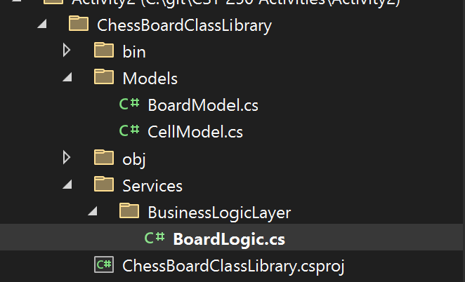
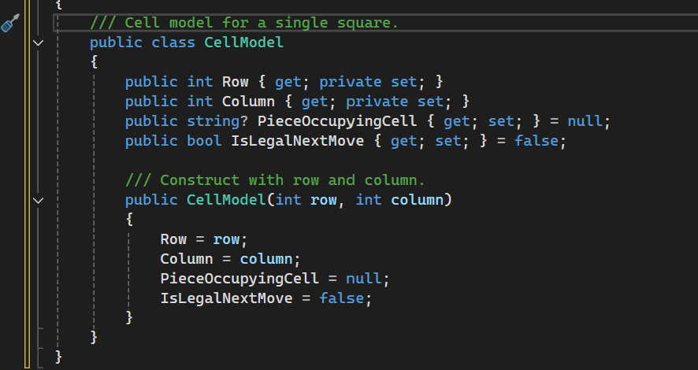
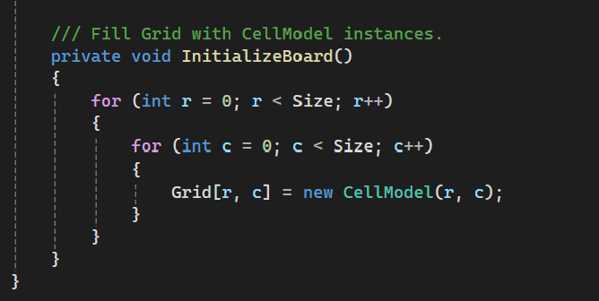
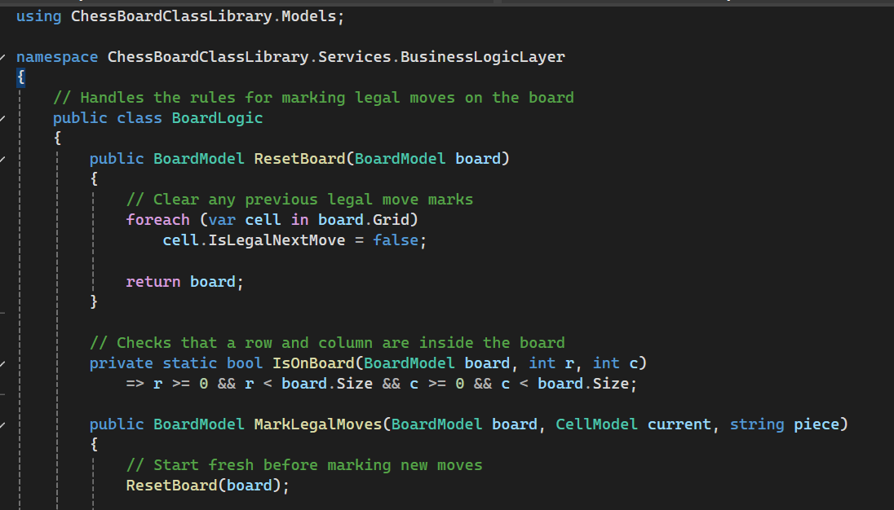
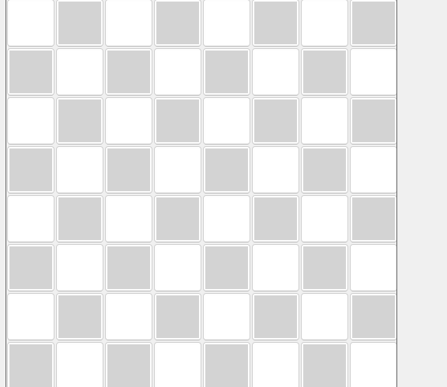
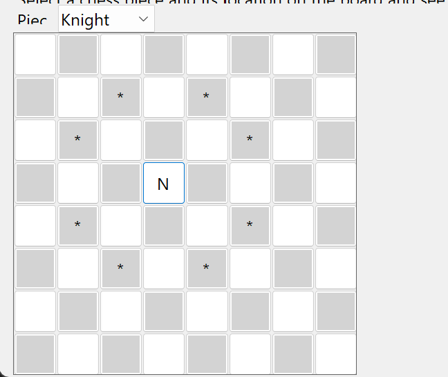
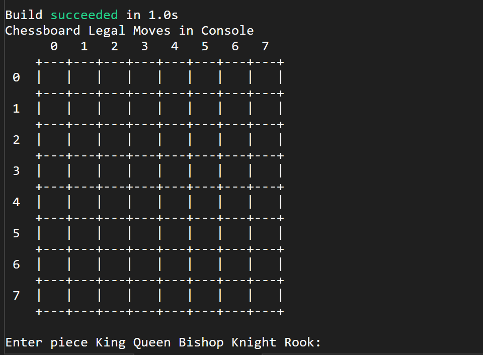
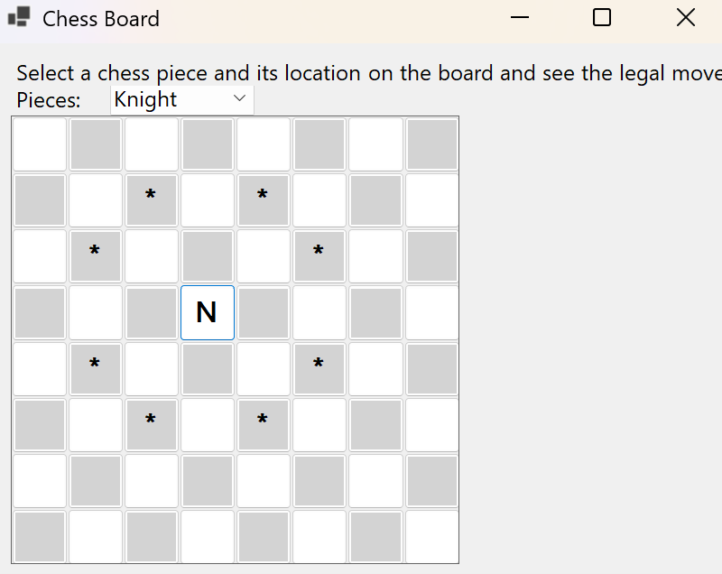
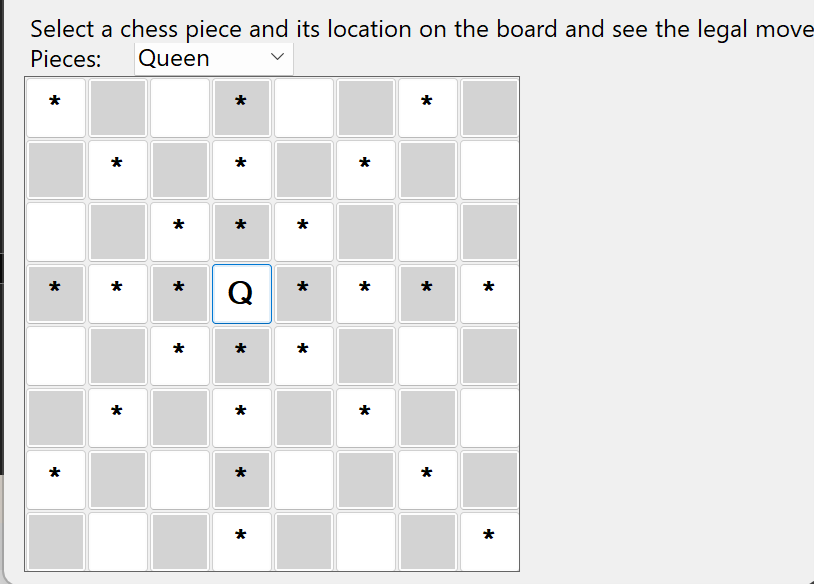
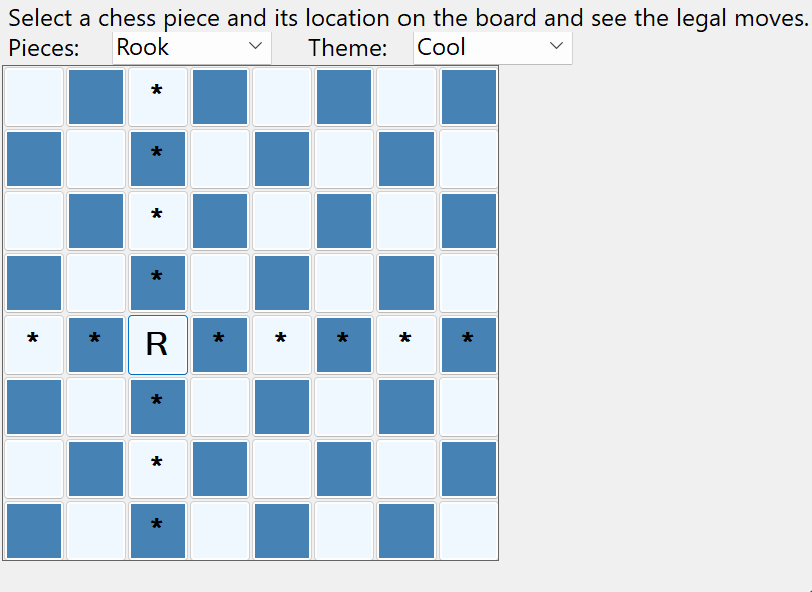

[Devin Puckett]

[CST-250 Programming in C#2]

[Grand Canyon University]

[10/23/2025]

[Activity 2]

[https://github.com/devinpuckett4/CST-250-Activity-2/blob/main/Activity2.md]

[https://www.loom.com/share/571f0ec6c7b94da19da10e386bf3e504?sid=00f830ff-a520-45fa-a28f-4e9c0f9b9cba]

 
FLOW CHART

Figure 1: Flow chart of Activity 1

This is the big picture of my Vehicle Store app. I start the program, set up the data layer and logic layer, and load any vehicles.
The form opens and then the user chooses what to do: view the list, add a vehicle, remove one, save the inventory, or load it back. Each arrow shows the call that happens in the logic layer, so the UI is only steering the actions. This matches the N-layer idea because the screen talks to StoreLogic, and StoreLogic talks to the DAO.

UML Class Diagram

Figure 2: UML Class Diagram

This diagram is the “map” of my Vehicle Store. At the center is a basic Vehicle that has the usual details like id, make, model, year, price, and wheels. The car, motorcycle, and pickup are just versions of that same vehicle with a couple extra details added on. The screen you see, called FrmVehicleStore, does not touch the data directly. Instead it talks to a helper class called StoreLogic, and StoreLogic talks to the data class. The data piece has a simple list of vehicles and handles getting them, adding, finding by id, and removing. The arrows just show who depends on who, so the screen uses the logic, the logic uses the data, and the models sit underneath everything.
Part 1
Figure 3: Project Folder Setup

This shows the folder structure for my ChessBoardClassLibrary project. I kept models, services, and logic organized into separate folders so it’s easier to navigate and update later.

Figure 4 Cellmodel Class

Here’s the CellModel class I created for each square on the chessboard. It stores row, column, the piece on that square, and if it’s a legal move. Keeping it simple made the logic easier to test.

Figure 5 InitialBoard Method

This shows the app with the inventory on top and the shopping cart on the bottom. I used the Add button to drop a couple of cars into the list, then selected them and hit Add to Cart so they appear in the lower grid. You can also see the running total updating down by the buttons.

Figure 6 BoardLogic Class

This class handles all the move logic for the game. It clears old legal moves, checks valid spots, and marks new ones depending on which piece was chosen. It keeps the game rules clean and separate from the UI.
Screen Shots

Part 2 

Figure 5: First Board shown

This is the first run of the GUI showing the 8x8 grid before any moves are made. Each square is clickable and tied to the logic layer that handles move checking.

Figure 6: First Knight Function

Here I picked the Knight and placed it in the middle of the board. The stars mark all legal moves it can make, showing the logic works just like the console version.

Figure 7 : Screenshots of Console 

This is the console version of the chessboard app right after launching. It shows an empty grid and prompts the user to enter which piece they want to test.

Figure 8 : Screenshot of Console Knight Function

After picking the Knight and a location, the console prints all legal moves using asterisks. It matches the GUI results, which shows both versions share the same back-end logic.

Part 3 GUI Application

Figure 9 Screenshot of Final Board

Here’s the GUI again, this time showing the dropdown for piece selection. I can choose any piece and click a square to see its valid moves right on the grid.

Figure 10 Screenshot of Knight Function

I selected Knight and clicked the center square. The stars show every L-shaped move it can make. This confirms the move rules are working.

 
Figure 11 Screenshot of Queen Function

I switched to Queen and placed it in the middle. The stars light up rows, columns, and diagonals. This proves the combined rook and bishop logic is correct.

 
Figure 12 Screenshot of Sctructure

This is how I organized the ChessBoardClassLibrary. Models hold the data and the BusinessLogicLayer handles the rules. Keeping it split up makes changes easier.

 
Figure 13 Screenshot of Theme Change

I chose Rook and turned on the Cool theme. The stars show all straight-line moves from the selected square. The styling helps the board read clean while I test moves.

ADD ON

Follow up Questions

1.	What was challenging?
Getting the layers wired up for Activity 2 took the most effort. I had to stop mixing UI and logic and keep Models, BoardLogic, and the WinForms screen in their own lanes. Laying out the 8 by 8 grid cleanly in WinForms was touchy at first, especially sizing the buttons and refreshing highlights. I also hit a few build and reference issues until I made sure the class library compiled first and the app was fully closed before rebuilding.

2.	 What did you learn?
I learned that a clean split makes the chessboard easier to reason about. BoardModel and CellModel hold the data, BoardLogic decides legal moves, and the form just shows the board and forwards clicks. Resetting the board before marking moves keeps things predictable. I also proved the rules by checking Knight, Rook, Bishop, and Queen and making sure GUI and console show the same results. Keeping it tidy helped me find mistakes fast.

3.	How would you improve the project?
I would add a quick way to pick a start square with row and column inputs and a clear highlight for the current piece. I would include an undo to clear the last selection and a toggle to show or hide legal moves. I would add a small status bar that explains why a move is legal. I would also save the last piece and theme so it opens the same way next time.

4.	 How can you use what you learned on the job?
This layering approach transfers well to real work. The UI stays simple, the move logic is testable, and the data models are easy to extend. Writing a couple of small tests before changes gives me confidence I did not break anything. Binding data to controls and refreshing the view applies to lots of internal tools. Overall, I can build small features faster and keep the code readable and easy to fix.

